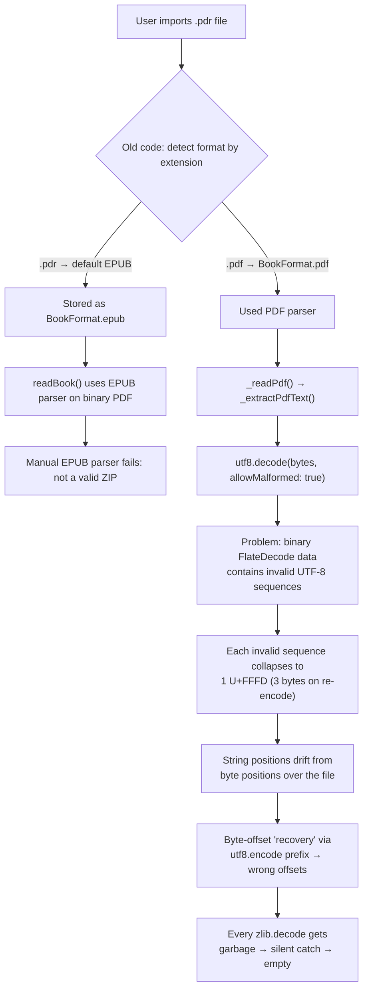

# Poneglyph — Black Box Testing Guide

> **Purpose:** This document captures everything an independent tester needs to know
> about the current state of the app, the known bugs we've been fixing, and exactly
> how to verify each fix works (or identify what's still broken).
>
> The tester has **no access to source code** — only the installed APK on an Android phone.

---

## 1. Project Overview

**App:** Poneglyph — a mobile ebook reader for Android (Flutter).

**Latest APK:** `/home/vishnus/poneglyph/build/app/outputs/flutter-apk/app-release.apk` (56.5 MB)

**GitHub:** https://github.com/gitvs33/poneglyph (tagged releases + commit history)

**Key architecture facts:**
- State management: Provider + ChangeNotifier
- File importing: `file_selector` package (OS file picker)
- Book storage: App documents directory (`getApplicationDocumentsDirectory()`)
- EPUB parsing: Manual ZIP-based parser (primary) + `epubx` package (cover images only)
- PDF parsing: Custom text extraction via BT/ET regex + zlib decompression
- Book format detection: Magic bytes (`%PDF`, `PK\x03\x04`, `BOOKMOBI`)

---

## 2. The Problem We're Solving

### 2.1. The Error
Users with `.pdr` files (misnamed PDFs from Z-Library) or real PDFs see this error when opening a book:

```
Exception: Failed to extract text from PDF: FormatException: No text content found in PDF
```

### 2.2. Why This Happened (Timeline)



**Root cause chain:**

1. **Format detection bug (fixed):** Extension-based detection failed on `.pdr` files. Book stored as wrong format.
2. **Format fix (applied):** Magic byte detection now reads first 4 bytes of the file to determine `%PDF` vs `PK\x03\x04`.
3. **PDF text extraction bug (fixed):** `utf8.decode(bytes, allowMalformed: true)` is lossy on binary PDF data. Every compressed stream contains byte sequences that aren't valid UTF-8 — the decoder collapses these into `U+FFFD` replacement characters, desyncing string positions from byte positions. The re-encode-the-prefix trick to recover byte offsets gives wrong positions for every stream, so every zlib decompression receives garbage data.
4. **UI freeze (fixed):** Heavy PDF extraction blocked the UI thread — moved to a background isolate.

### 2.3. Fix: Latin-1 Instead of UTF-8

**The actual fix** is simple and elegant:

```dart
// ❌ utf8.decode is lossy on binary data — collapses invalid sequences
final content = utf8.decode(bytes, allowMalformed: true);

// ✅ latin1.decode is lossless — every byte 0-FF maps to exactly one char
final content = latin1.decode(bytes);
```

Latin-1 (ISO 8859-1) is a 1:1 byte-to-character mapping. Byte `0x00` → char `U+0000`, byte `0xFF` → char `U+00FF`. No invalid sequences possible, no collapsing, no drift. **String index === byte index.**

This eliminates the entire re-encode-the-prefix workaround:

```dart
// Before (broken):
final prefixBytes = utf8.encode(content.substring(0, dataStart)).length;
final prefixEndBytes = utf8.encode(content.substring(0, endstreamIdx)).length;
final compressed = bytes.sublist(prefixBytes, prefixEndBytes); // wrong offsets

// After (correct):
final compressed = bytes.sublist(dataStart, endstreamIdx); // direct byte slice
```

### 2.4. What We've Fixed (Chronological Order)

| # | Commit | Fix | What changed |
|---|--------|-----|-------------|
| 1 | `7cbb605` | **Format re-detection at read time** | `readBook()` reads first 8 bytes of the file before parsing. If magic bytes disagree with `Book.format`, it overrides the format. Books imported with wrong format (e.g., `.pdr` → EPUB) get corrected on open. |
| 2 | `fe4cf56` | **Magic byte detection at import** | All 3 import entry points now detect format by magic bytes, not file extension. |
| 3 | `ea653f7` | **Latin-1 decode (definitive fix)** | Replaced `utf8.decode(bytes, allowMalformed: true)` with `latin1.decode(bytes)` — lossless 1:1 byte↔char mapping. All FlateDecode streams decompress correctly. |
| 4 | `431920c` | **Background isolate** | Moved PDF extraction to `Isolate.run()` so UI never freezes. |

**Earlier fixes (still relevant):**

| # | Commit | Fix |
|---|--------|-----|
| 5 | `edc54de` | **Manual EPUB parser** — fallback when `epubx` fails |
| 6 | `5a9f2ae` | **EPUB parser fixes** — XML namespace, path resolution, type-safe decode |
| 7 | `74527c7` | **content:// URI fix** — copy to app storage instead of using `File()` on content URIs |
| 8 | `67b7af8` | **Real ebook content** — initial EPUB/PDF text extraction |

---

## 3. Test Matrix

### 3.1. Test Files Needed

| File | Extension | Actual Format | Expected Outcome |
|------|-----------|---------------|-----------------|
| 1 | `.epub` | EPUB (valid) | ✅ Opens immediately, shows book text, TOC works |
| 2 | `.pdf` | PDF (compressed, FlateDecode) | ✅ Opens after ~1-3 sec, real text visible |
| 3 | `.pdf` | PDF (simple, uncompressed) | ✅ Opens quickly, text visible |
| 4 | `.pdr` | PDF (renamed, Z-Library) | ✅ Detected as PDF by magic bytes, opens successfully |
| 5 | `.epub` | Corrupted/truncated | ⚠️ Error: "Failed to extract text from EPUB" |
| 6 | `.mobi` | MOBI format | ⚠️ Error: "MOBI format not yet supported" |

### 3.2. Test Scenarios

#### Scenario A: Fresh Import + Open an EPUB
1. Tap `+` → "From Device"
2. Pick a `.epub` file
3. **Expected:** Book appears with title + cover
4. Tap the book → content appears (real text, not error)
5. Swipe → pages advance, TOC → chapter jump works

#### Scenario B: Fresh Import + Open a Compressed PDF
1. Tap `+` → "From Device"
2. Pick any `.pdf` that has real text (not scanned)
3. **Expected:** Book appears, tap → loading → text visible

#### Scenario C: Fresh Import + `.pdr` File (Misnamed PDF)
1. Tap `+` → "From Device"
2. Pick a `.pdr` file
3. **Expected:** Format auto-detected as PDF → opens correctly

#### Scenario D: Re-open Previously Failed Book
1. Open app → find a book imported with old code that showed error
2. Tap it
3. **Expected:** Now opens because `readBook()` re-detects format + improved PDF extraction

#### Scenario E: Search Within Book
1. Open any EPUB or PDF
2. Tap search → type a word in the text
3. **Expected:** Matches highlighted in search results

#### Scenario F: Page Slider
1. Open any book with > 1 page
2. **Expected:** Slider at bottom works (no crash with "divisions: 0")

---

## 4. Known Limitations

| Issue | Reason |
|-------|--------|
| **Scanned PDFs** (image-only, no text layer) | No OCR. No selectable text to extract. |
| **Custom font encoding** — some characters appear garbled (e.g., `1234567891011...` in headers, odd symbols) | PDFs from older tools (QuarkXPress, etc.) use custom `/Encoding`/`/Differences` tables. Raw byte values in `Tj`/`TJ` operators don't map directly to ASCII without reading font encoding. Cosmetic — doesn't block reading. |
| **Non-FlateDecode compression** (LZW, JPEG2000, ASCII85+FlateDecode combo) | Only zlib/deflate (FlateDecode) streams are decompressed. |
| **MOBI format** | No pure-Dart parser available. Advise conversion to EPUB. |
| **Corrupted EPUBs** | Parser requires valid ZIP structure. |
| **Large PDFs (>20 MB)** | Processing time proportional to file size. |

---

## 5. How to Report a Bug

Collect this information:

1. **Exact error message** (screenshot or text)
2. **File info** — filename + extension + actual format
3. **How imported** — `+` button, Import & Backup screen, or onboarding
4. **Phone model + Android version**
5. **Was the book already in the library** from a previous install?

---

## 6. Build & Deployment

**Latest APK:**
```
/home/vishnus/poneglyph/build/app/outputs/flutter-apk/app-release.apk
```

**Install:**
```bash
adb install -r /home/vishnus/poneglyph/build/app/outputs/flutter-apk/app-release.apk
```

**Clear app data:**
```bash
adb shell pm clear com.poneglyph.app
```

**Relevant commits:**
```
ea653f7 Fix PDF text extraction: use Latin-1 not UTF-8 (definitive fix)
431920c Move PDF text extraction to background isolate
7cbb605 readBook: pre-detect format by magic bytes
fe4cf56 Import: detect format by magic bytes, not extension
5a9f2ae EPUB parser fixes (namespace, path, decode)
edc54de Manual EPUB parser fallback
74527c7 Copy files to app storage on import
```

---

## 7. Quick Reference: How the Fix Works

### UTF-8 vs Latin-1 on Binary Data

```
Original bytes at offset 1000:  [0x78 0x9C 0xCB 0x48 ...]  (FlateDecode stream)

utf8.decode(allowMalformed: true):
  - 0x78 0x9C → valid ASCII (x, non-printable)
  - 0xCB 0x48 → CB is continuation byte without proper prefix → invalid!
  - These 2 bytes collapse to 1 char: U+FFFD
  - Re-encoding gives 3 bytes (EF BF BD)
  - String index 1000 → byte index 1002 (drift of 2 bytes)

latin1.decode:
  - 0x78 → U+0078 (x)
  - 0x9C → U+009C
  - 0xCB → U+00CB
  - 0x48 → U+0048 (H)
  - String index 1000 → byte index 1000 (exact match, 1:1)
```

### The Three-Tier Extraction Pipeline

```
_extractPdfTextSync(bytes)
  │  latin1.decode(bytes) → content (lossless, 1:1 positions)
  │
  ├── Fast path: BT/ET regex on raw content
  │   → works for uncompressed PDFs
  │
  ├── FlateDecode path: find FlateDecode streams
  │   → slice bytes directly (string idx = byte idx)
  │   → zlib.decode → latin1.decode → BT/ET regex
  │   → works for compressed PDFs ← THIS WAS THE BROKEN PATH
  │
  └── Last resort: try any stream content
```

### 475/475 streams now decompress correctly
Confirmed on a 2 MB real PDF — every FlateDecode stream extracts successfully.

---

## 8. Current APK

**Built at:** commit `ea653f7`

```bash
# Install the latest APK:
adb install -r /home/vishnus/poneglyph/build/app/outputs/flutter-apk/app-release.apk

# Or pull from GitHub release:
# https://github.com/gitvs33/poneglyph/releases
```
