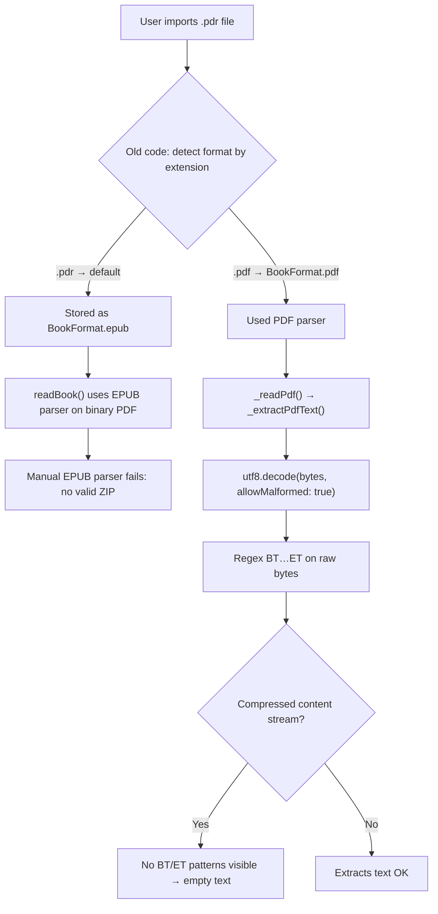

# Poneglyph — Black Box Testing Guide

> **Purpose:** This document captures everything an independent tester needs to know
> about the current state of the app, the known bugs we've been fixing, and exactly
> how to verify each fix works (or identify what's still broken).
>
> The tester has **no access to source code** — only the installed APK on an Android phone.

---

## 1. Project Overview

**App:** Poneglyph — a mobile ebook reader for Android (Flutter).

**Latest APK:** `/home/vishnus/poneglyph/build/app/outputs/flutter-apk/app-release.apk` (56.5 MB)

**GitHub:** https://github.com/gitvs33/poneglyph (tagged releases + commit history)

**Key architecture facts:**
- State management: Provider + ChangeNotifier
- File importing: `file_selector` package (OS file picker)
- Book storage: App documents directory (`getApplicationDocumentsDirectory()`)
- EPUB parsing: Manual ZIP-based parser (primary) + `epubx` package (cover images only)
- PDF parsing: Custom text extraction via BT/ET regex + zlib decompression
- Book format detection: Magic bytes (`%PDF`, `PK\x03\x04`, `BOOKMOBI`)

---

## 2. The Problem We're Solving

### 2.1. The Error
Users with `.pdr` files (misnamed PDFs from Z-Library) see this error when opening a book:

```
Exception: Failed to extract text from PDF: FormatException: No text content found in PDF
```

### 2.2. Why This Happened (Timeline)



**Root cause chain:**

1. **Format detection bug (fixed):** Extension-based detection failed on `.pdr` files. Book stored as wrong format.
2. **Format fix (applied):** Magic byte detection now reads first 4 bytes of the file to determine `%PDF` vs `PK\x03\x04`.
3. **PDF text extraction bug (partially fixed):** Even when correctly identified as PDF, the extractor only searched raw bytes for `BT...ET` text objects. Most real PDFs compress content streams with zlib (FlateDecode), so no text patterns are visible in raw UTF-8 decoded content.
4. **UI freeze (fixed):** The PDF extraction runs synchronously on the main thread. zlib decompression of a multi-megabyte PDF blocks Flutter's event loop for seconds → app appears frozen.

### 2.3. What We've Fixed (Chronological Order)

| # | Commit | Fix | What changed |
|---|--------|-----|-------------|
| 1 | `7cbb605` | **Format re-detection at read time** | `readBook()` reads first 8 bytes of the file before parsing. If magic bytes disagree with `Book.format`, it overrides the format. Books imported with wrong format (e.g., `.pdr` → EPUB) get corrected on open. |
| 2 | `fe4cf56` | **Magic byte detection at import** | All 3 import entry points (Library + button, ImportBackupScreen, Onboarding ImportPage) now detect format by magic bytes, not file extension. `%PDF` → PDF, `PK\x03\x04` → EPUB, `BOOKMOBI` → MOBI. |
| 3 | `12641bc` | **FlateDecode (zlib) stream decompression** | New three-tier PDF text extraction: (a) BT/ET regex on raw bytes for simple PDFs; (b) find FlateDecode streams, decompress with `zlib.decode()`, then BT/ET; (c) try any stream content. |
| 4 | `431920c` | **Background isolate for PDF extraction** | Moved all PDF text extraction to `Isolate.run()` so the UI thread never freezes. App shows loading spinner while extraction runs. |

**Earlier fixes (not directly related but still relevant to testing):**

| # | Commit | Fix |
|---|--------|-----|
| 5 | `edc54de` | **Manual EPUB parser** — When `epubx` fails (many real EPUBs do), falls back to manual ZIP-based parser using the `archive` package. |
| 6 | `5a9f2ae` | **EPUB parser fixes** — XML namespace bug (query with `namespace: '*'`), path resolution (try multiple paths), type-safe content decode. |
| 7 | `74527c7` | **content:// URI fix** — Android returns content URIs that `File()` can't read. All imports now copy bytes to app documents directory. |
| 8 | `67b7af8` | **Real ebook content** — First implementation of EPUB/PDF text extraction. Removed lorem ipsum placeholder. |

---

## 3. Test Matrix

### 3.1. Test Files Needed

| File | Extension | Actual Format | Expected Outcome |
|------|-----------|---------------|-----------------|
| 1 | `.epub` | EPUB (valid) | ✅ Opens immediately, shows book text, table of contents works |
| 2 | `.pdf` | PDF (simple, uncompressed) | ✅ Opens after short loading, text visible |
| 3 | `.pdf` | PDF (compressed with FlateDecode) | ✅ Opens after ~1-3 sec loading, text visible |
| 4 | `.pdr` | PDF (renamed, from Z-Library) | ✅ Format detected as PDF, opens after ~1-3 sec |
| 5 | `.epub` | Corrupted/truncated EPUB | ⚠️ Shows error: "Failed to extract text from EPUB" |
| 6 | `.mobi` | MOBI format | ⚠️ Shows error: "MOBI format not yet supported" |
| 7 | `.txt` | Plain text | ❌ Unknown format → likely tries EPUB → fails |

### 3.2. Test Scenarios

#### Scenario A: Fresh Import + Open an EPUB
1. Tap `+` button on Library screen
2. Select "From Device"
3. Pick a `.epub` file from file picker
4. **Expected:** Book appears in library with correct title + author + cover
5. Tap the book
6. **Expected:** Loading spinner → book content appears (real text, not error)
7. Swipe left/right → pages advance
8. Tap TOC icon → chapter list appears → tapping a chapter jumps to it

#### Scenario B: Fresh Import + Open a PDF (compressed)
1. Tap `+` → "From Device"
2. Pick a `.pdf` file (a real book PDF, not a scanned document)
3. **Expected:** Book appears in library
4. Tap the book
5. **Expected:** Loading spinner (~1-3 sec) → text content appears
6. **Note:** Scanned PDFs (images only, no text layer) will fail — this is expected

#### Scenario C: Fresh Import + Open a `.pdr` file (misnamed PDF)
1. Tap `+` → "From Device"
2. Pick a `.pdr` file
3. **Expected:** Book appears in library (format detected as PDF by magic bytes)
4. Tap the book
5. **Expected:** Loading spinner → text content appears (same as Scenario B)

#### Scenario D: Re-open a previously failed book (already in library from old import)
1. Open the app
2. Find a book that was previously imported (before fixes) and showed error
3. Tap it
4. **Expected:** Now opens successfully because `readBook()` re-detects format at read time
5. **If it still fails:** Note the exact error message (it now includes `Format:` and `Path:` lines)

#### Scenario E: Onboarding Import
1. Delete app data or reinstall
2. Launch app → Onboarding screen appears
3. On Import page, select files
4. **Expected:** Books import correctly during onboarding

#### Scenario F: Search within book
1. Open any EPUB or PDF book
2. Tap search icon
3. Type a word that appears in the text
4. **Expected:** Search results show matches in the book content

#### Scenario G: Multi-page navigation with slider
1. Open any book
2. **Expected:** Page slider at bottom works (doesn't crash with "divisions: 0")

---

## 4. Known Limitations (Won't Fix)

| Issue | Reason |
|-------|--------|
| Scanned PDFs (image-only, no text layer) | No OCR capability. These contain no selectable text. |
| Complex PDFs with JPEG2000 images or special encodings | Only FlateDecode (zlib) streams are decompressed. Other compression filters are skipped. |
| MOBI format | Binary format with no standard pure-Dart parser. We could add the `mobi` package but it requires native bindings. Users are advised to convert to EPUB. |
| Corrupted EPUBs | The parser doesn't try to recover damaged ZIP archives. It gives up and shows an error. |
| Large PDFs (>20 MB) | Allocate processing. May take several seconds on slow phones. |

---

## 5. How to Report a Bug

If a test fails, collect this information:

1. **The exact error message** (screenshot or copy-paste) — newer APKs show `Format:` and `Path:` lines
2. **What file you used** (filename + extension + actual format if known)
3. **How you imported it** ("From Device" button, "Import & Backup" screen, or onboarding)
4. **Phone model + Android version**
5. **Did the book open before** (i.e., was it already in your library from a previous install)?

### Example good bug report:
```
File: "This Is Your Brain on Music.pdr" (Z-Library download)
Import: + button → From Device
Phone: Pixel 7, Android 14

Error: 
  Exception: Failed to extract text from PDF: 
  Format: BookFormat.pdf
  Path: /storage/emulated/0/Android/data/com.poneglyph.app/files/This Is Your Brain on Music.pdr

Notes:
  - Imported with older APK, first opened with new APK
  - Shows loading spinner for ~2 seconds then this error
  - Same file imported fresh on new APK → same error
```

---

## 6. Build & Deployment Info

**Latest APK location:**
```
/home/vishnus/poneglyph/build/app/outputs/flutter-apk/app-release.apk
```

**How to install:**
```bash
adb install -r /home/vishnus/poneglyph/build/app/outputs/flutter-apk/app-release.apk
```

**How to clear app data (for fresh test):**
```bash
adb shell pm clear com.poneglyph.app
```

**Commit history (relevant):**
```
431920c Move PDF text extraction to background isolate
12641bc Fix PDF text extraction: handle FlateDecode (zlib) compressed streams
7cbb605 readBook: pre-detect format by magic bytes before any parsing
fe4cf56 Fix wrong-format crash: detect format by magic bytes, not extension
5a9f2ae Fix EPUB parser: XML namespace bug, robust path resolution, type-safe decode
edc54de Fix EPUB parsing: add manual parser fallback when epubx fails
74527c7 Fix 'could not load content' — copy imported files to app storage
67b7af8 Real ebook content rendering (initial EPUB/PDF text extraction)
```

---

## 7. Quick Reference: What Each Fix Actually Does

### Fix: Format Re-detection (`readBook()`)
```
File on disk has magic bytes %PDF → set Book.format = BookFormat.pdf
                                   → call _readPdf()
                                   → Text extraction...

File on disk has magic bytes PK\x03\x04 → set Book.format = BookFormat.epub
                                         → call _readEpub()
                                         → ZIP extraction, HTML parsing...

File has no matching magic bytes → fall back to stored Book.format
```

### Fix: PDF Text Extraction (three tiers)

```
_extractPdfText(bytes)
  ├─ Fast path: utf8.decode → BT...ET regex → if text found, return
  ├─ Zlib path:  find FlateDecode streams → zlib.decode → BT...ET → if text found, return
  └─ Last resort: try any stream content → BT...ET → return (may be empty)
```

### Fix: Background Isolate
```
_extractPdfText(bytes) now does:
  return await Isolate.run(() => _extractPdfTextSync(bytes));
  
This runs the entire three-tier extraction on a background thread.
The UI shows a CircularProgressIndicator while waiting.
```
